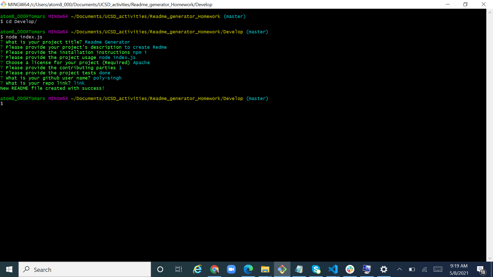
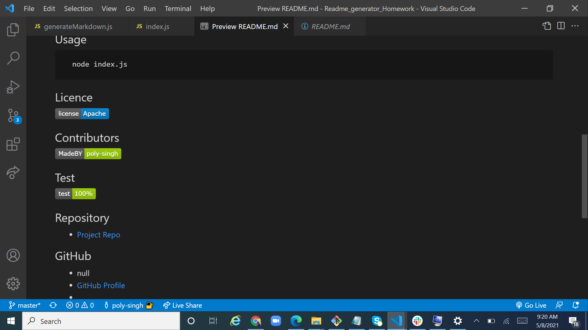
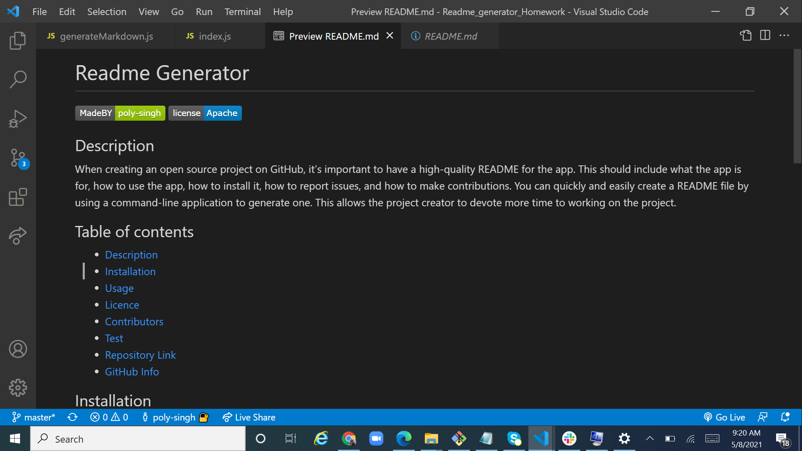

# Readme Generator

## Description 
When creating an open source project on GitHub, it’s important to have a high-quality README for the app. This should include what the app is for, how to use the app, how to install it, how to report issues, and how to make contributions.
You can quickly and easily create a README file by using a command-line application to generate one. This allows the project creator to devote more time to working on the project.

Application Video link
- [video](https://drive.google.com/file/d/1tgB2zcHk1AtAV2RHYNzImFjU6-V_YpAZ/view?usp=sharing)
## Table of contents
- [Description](#Description)
- [Installation](#Installation)
- [Usage](#Usage)
- [Licence](#Licence)
- [Contributors](#Contributors)
- [Test](#Test)
- [Repository Link](#Repository)
- [GitHub Info](#GitHub) 
## Installation
      npm i        
## Usage
      node index.js        
## Licence

## Contributors

## Test

## Repository
- [Project Repo](https://github.com/poly-singh/Readme_generator_Homework)
## GitHub

- null
- [GitHub Profile](https://github.com/poly-singh)
- <undefined>

### Application Screenshots

